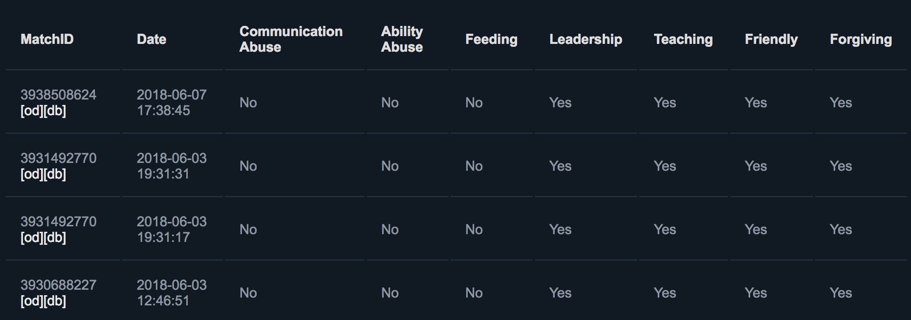
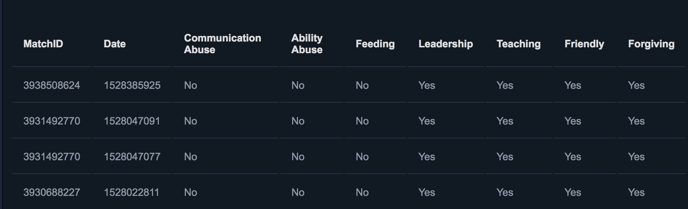

Chrome plugin that formats the [Dota 2 reports page](https://steamcommunity.com/my/gcpd/570/?category=Account&tab=MatchPlayerReportIncoming)

After:

Before:

## Development

PRs welcome!

### Running the app

1. Clone the repo
2. Visit `chrome://extensions/` in Google Chrome
3. Click "LOAD UNPACKED"
4. Select the directory for `dota-report-analyzer`
5. Visit the reports page to see it in action!
