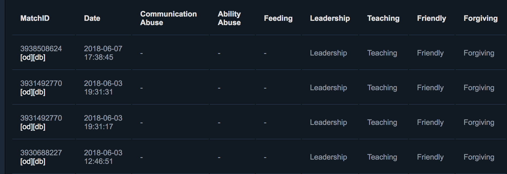

Chrome plugin that formats the [Dota 2 reports page](https://steamcommunity.com/my/gcpd/570/?category=Account&tab=MatchPlayerReportIncoming)

After:

Before:

Note: It may take a few seconds to load all your data

## Development

PRs welcome!

### Running the app

1. Download the code from GitHub
2. Visit `chrome://extensions/` in Google Chrome
3. Click "LOAD UNPACKED"
4. Select the directory `dota-report-analyzer/src`
5. Visit your [reports page](https://steamcommunity.com/my/gcpd/570/?category=Account&tab=MatchPlayerReportIncoming) to see it in action!

## Contributors

Thanks goes to these wonderful people ([emoji key](https://github.com/kentcdodds/all-contributors#emoji-key)):

<!-- ALL-CONTRIBUTORS-LIST:START - Do not remove or modify this section -->
<!-- prettier-ignore -->
| [ <b>Canna Wen</b>](https://www.cannawen.com) [💻](https://github.com/cannawen/dota-report-analyzer/commits?author=cannawen "Code") | [ <b>Yarno Boelens</b>](http://yarnoboelens.com) [💻](https://github.com/cannawen/dota-report-analyzer/commits?author=yarwest "Code") |
| :---: | :---: |
<!-- ALL-CONTRIBUTORS-LIST:END -->

This project follows the [all-contributors](https://github.com/kentcdodds/all-contributors) specification. Contributions of any kind welcome!